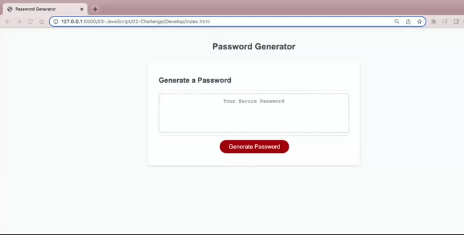

# Password Generator Challenge 

This challenge was to create a password generator that creates a password with a length of at least 8 characters and no more than 128 characters. The password generator will have the ability to create a password with a combination of lowercase, uppercase, numeric or special characters. 

The password generator will prompt the user with the following prompts: 

* To choose the password length of at least 8 characters and no more than 128 characters 
* Choose between having uppercase, numeric, or special characters in the password 
* If user decides not to include any uppercase, numeric or special characters the password created will only be in lowercase letters. 
* Once the user answers all the prompts the generator will create a password according to the user's choices 

# 

The following animation shows the web application's appearance and functionality: 

#

Link to deployed application: https://zeinabhared.github.io/Password-Generator/
